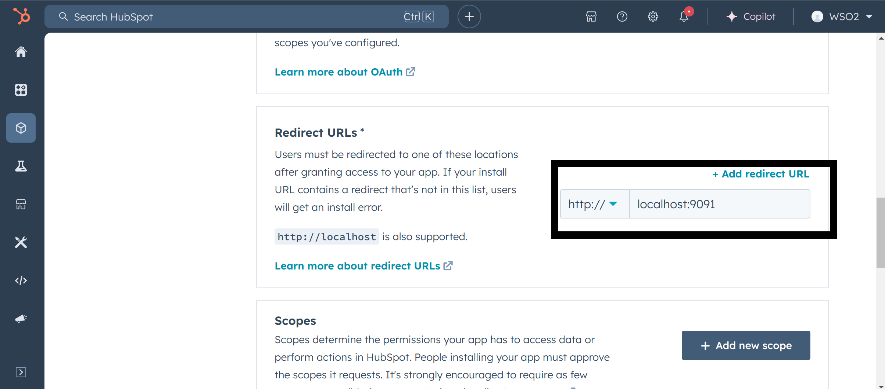
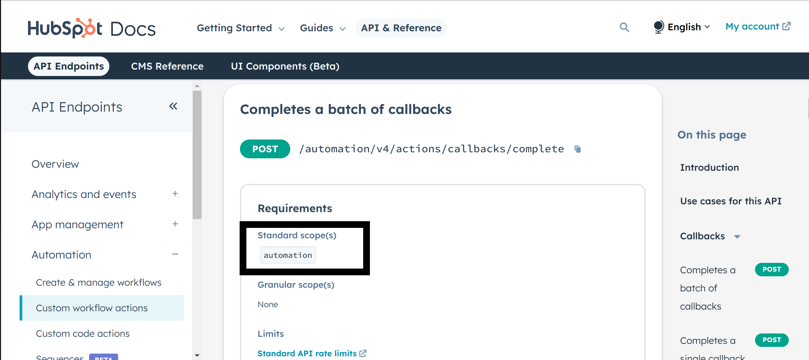
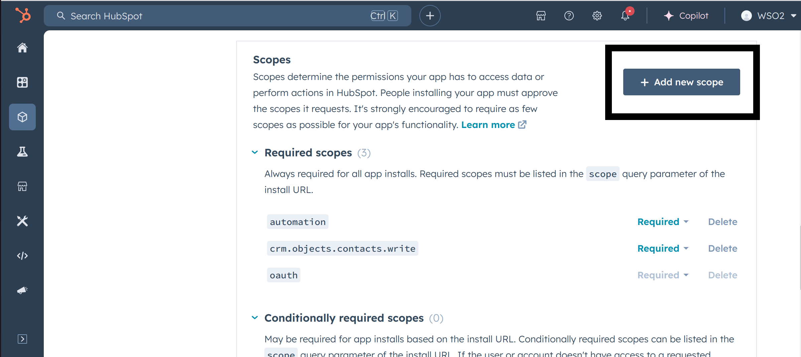
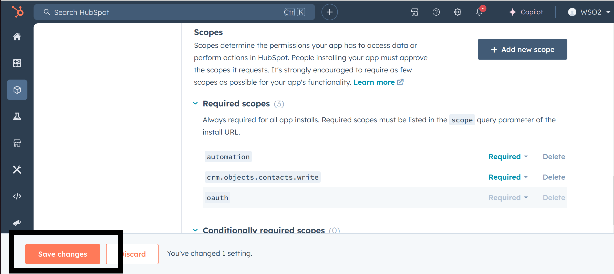
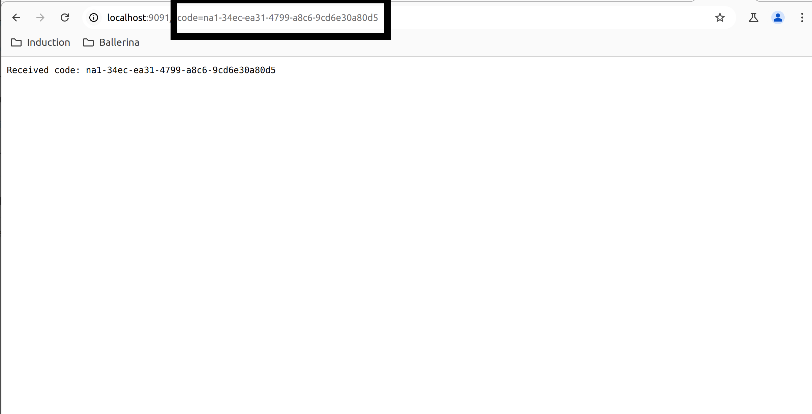

## Overview

[HubSpot ](https://www.hubspot.com/) is an AI-powered customer relationship management (CRM) platform. 

The `ballerinax/hubspot.automation.actions` offers APIs to connect and interact with the [Automation Actions](https://developers.hubspot.com/docs/reference/api/automation/custom-workflow-actions)  endpoints, specifically based on the [API v4](https://developers.hubspot.com/docs/reference/api/automation/custom-workflow-actions)

## Setup guide

To use the Hubspot Automation action API connector in Ballerina, you must have a HubSpot developer account. If you don't have an account, create one using the following steps.

### Step 1: Create a Hubspot Developer Account

Visit the [Hubspot portal](https://developers.hubspot.com/get-started) and create a Developer Account.

### Step 2: Create a Hubspot Developer Test Account

Visit [developer test account page](https://developers.hubspot.com/beta-docs/getting-started/account-types#developer-test-accounts) and create a Hubspot developer test account.
### Step 3: Create a Hubspot Public App

In your developer account, navigate to the "Apps" section.

Click on "Create App" and provide the necessary details, including the app name and description.


### Step 4: Initiate the OAuth Flow

Move to the auth tab in the created app and set the permissions there.

Under the OAuth tab you can find the following details,

* `client_id`: Your app's Client ID.
* `redirect_uri`: The URL users will be redirected to after granting access.
* `scope`: A space-separated list of scopes your app is requesting.


### Step   5: Add the redirect URL

Add your redirect url under the redirect urls.



### Step   6: Add the Required Scopes

Go to the relevant API documentation (https://developers.hubspot.com/docs/reference/api/automation/custom-workflow-actions) and find out the required scopes.

For Automation Actions, we require the 'automation' scope.



Go back to the Auth Page and add the required scopes under the Auth tab .



Save the app



### Step   7: Obtain the authorization code

Copy the App installation url and paste it in the web browser.


 It wll prompt you to install  the App and then select your deveper test account.

After selecting the developer test account, you will receive a authorization code displayed in the browser.



### Step   8: Obtain the access token

Place your `authorization_code`, `client_id` and `client_secret` in the folowing comand and execute it in the terminal

'curl --request POST \
  --url https://api.hubapi.com/oauth/v1/token \
  --header 'content-type: application/x-www-form-urlencoded' \
  --data 'grant_type=authorization_code&code=<authorization_code>&redirect_uri=http://localhost:9090&client_id=<client_id>&client_secret=<client_secret>'

In order to receive a token we need to run a listener at the provided redirect uri.

If the command executes successfully , you will receive the access token from the response.

### Step   9: Obtaining the developer API key

Follow the instructions at (https://developers.hubspot.com/docs/api/developer-tools-overview#developer-api-keys) to obtain the developer API key.

## Quickstart

To begin using the `Hubspot Automation API` connector in your Ballerina application, you'll need to follow these steps:

### Step 1: Import the connector

First, import the `ballerinax/hubspot.automation.actions` package into your Ballerina project.

```ballerina
import ballerinax/hubspot.automation.actions;
```

### Step 2: Instantiate a new connector

Create a `actions:ConnectionConfig` object with your domain and developer API token, and initialize the connector.

```ballerina
actions:ConnectionConfig config = {
   auth:{
    hapikey:"<developer-api-key>" ,
    private\-app\-legacy: ""
}
};
actions:Client hubspotAutomation = check new (config);
```

### Step 3: Invoke the connector operation

Utilize the connector's operations to manage extensions and functions.

#### Create an extension

```ballerina

actions:FieldTypeDefinition typeDefinition = {
    referencedObjectType: "OWNER",
    externalOptions: false,
    externalOptionsReferenceType: "",
    name: "optionsInput",
    'type: "enumeration",
    fieldType: "select",
    optionsUrl: "https://webhook.site/94d09471-6f4c-4a7f-bae2-c9a585dd41e0",
    options: []
};

actions:InputFieldDefinition inputFieldDefinition = {
    isRequired: true,
    automationFieldType: "",
    typeDefinition: typeDefinition,
    supportedValueTypes: ["STATIC_VALUE"]
};


actions:PublicActionFunction publicActionFunction = {
    functionSource: "exports.main = (event, callback) => {\r\n  callback({\r\n    outputFields: {\r\n      myOutput: \"example output value\"\r\n    }\r\n  });\r\n}",
    functionType: "POST_ACTION_EXECUTION"
};

actions:PublicActionDefinitionEgg testingPublicActionDefinitionEgg = {
    inputFields: [inputFieldDefinition],
    actionUrl: "https://webhook.site/94d09471-6f4c-4a7f-bae2-c9a585dd41e0",
    published: false,
    objectTypes: ["CONTACT"],
    objectRequestOptions: { properties: ["email"] },
    functions: [publicActionFunction],
    labels: {
        "en": {
            "inputFieldLabels": {
                "staticInput": "Static Input",
                "objectInput": "Object Property Input",
                "optionsInput": "External Options Input"
            },
            "actionName": "My Extension",
            "actionDescription": "My Extension Description",
            "appDisplayName": "My App Display Name",
            "actionCardContent": "My Action Card Content"
        }
    }
};


actions: PublicActionDefinition response = check hubspotAutomation->/automation/v4/actions/[appId].post(testingPublicActionDefinitionEgg);
```

#### List definitions

```ballerina

actions : CollectionResponsePublicActionDefinitionForwardPaging response = check hubspotAutomation->/automation/v4/actions/[appId];

```

## Examples

The `Hubspot Automation API` connector provides practical examples illustrating usage in various scenarios. Explore these [examples](../examples/), covering the following use cases:

1. [Extension CRUD](../examples/) - Perform CRUD operations on Extensions
2. [Call complete callback APIs](../examples/) - complete callbacks using the  Hubspot API
